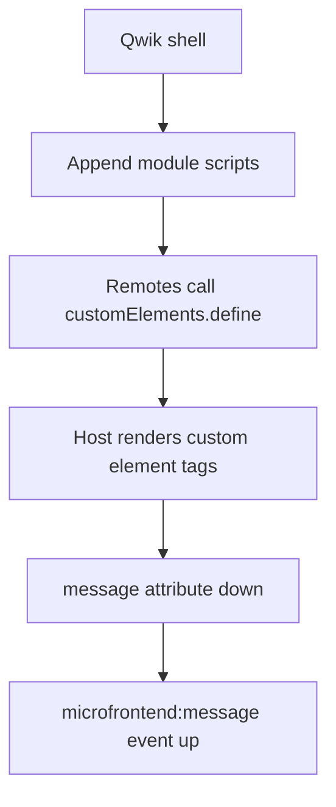

Once you have a reason to split the UI, the next decision is how the pieces become one page. That assembly step is **composition**: the host application — the shell — decides where each slice renders and what it is allowed to see.

There are a few honest ways to do it. I picked one for the companion: the browser loads separately built bundles and mounts them as [custom elements](https://developer.mozilla.org/en-US/docs/Web/API/Web_components/Using_custom_elements) — HTML tags the host did not compile. That is client-side composition. It is not the only option, and it is not a production platform by itself.

If you are still deciding *whether* to split, start with [Micro Frontends: Why?](/2024/05/09/micro-frontends-why/). This post assumes you already have a reason. The [working example](/2024/05/11/micro-frontends-working-example/) is the code. This post is the method.

## What the browser actually does

In the companion, Qwik is the shell. Angular and React are remotes. On first paint the host is an empty slot and a "loading" line. Then this happens:

The host appends `<script type="module">` tags for `mfes/angular/polyfills.js`, `mfes/angular/main.js`, and `mfes/react/react-microfrontend.js`. Those files live under `qwik-micro-frontend/public/mfes/` after each remote's own build. The host does not import Angular. It does not share a Webpack runtime. It waits for `customElements.define('angular-microfrontend', …)` and `customElements.define('react-microfrontend', …)`, then renders the tags.

That is the whole integration surface: two tag names, one attribute, one event name. The compile-time coupling is the contract, not the frameworks.

`npm run dev` at the repo root builds Angular, React, and optional Rust, *then* starts one Qwik server. Independent **builds**. One process serving static files. Do not read "micro frontend" and hear "four production deploys." That would be extra infrastructure on top of this method, not this method.

## Why custom elements

The companion has to host an Angular app and a React app without forcing either one onto Qwik's compiler. Custom elements are the smallest shared runtime those three stacks already agree on. Angular can register one with `createCustomElement`. React can wrap a root in `HTMLElement`. The host treats both as tags it did not author.

The interface is the point. A custom element is an HTML tag with a class behind it. Attributes go in; the class can fire events. You do not need to agree on JSX, NgModules, or Qwik's `$`. You agree on the DOM.

That is also why this demo is not [Module Federation](https://webpack.js.org/concepts/module-federation/) and not [single-spa](https://single-spa.js.org/). Those tools earn their keep when you have many remotes, shared dependency versions, and a routing story that cannot live in one host file. A two-remote demo does not need a module-sharing runtime. Adding one would hide the contract behind a bundler plugin — the opposite of what this series is trying to show.

A monorepo tool (Nx, for example) can hold these apps in one repository. That is a workspace choice, not a composition runtime. Do not confuse the two.

## The other ways, and when they win

**Server-side composition** assembles HTML before it reaches the browser. The user gets markup in the first response. That helps first paint and SEO. It gets harder when remotes use different frameworks and release on different clocks: the server that stitches them must know every remote's current HTML, or must wait on every remote at request time. Use it when the page is public and the remotes can publish HTML, not only JavaScript.

**Edge composition** does the same job at a CDN. [Cloudflare has written about that pairing](https://blog.cloudflare.com/better-micro-frontends). You keep the stitch close to the user and off your origin. It is real infrastructure. It is not what a local Vite demo needs.

**iframes** are the oldest isolation story. They give you a hard sandbox: CSS cannot leak, JS cannot collide. They also give you a terrible page: scrolling, focus, height, and deep links all become cross-document problems. Use an iframe for a third-party you do not trust. Do not use one to host your own checkout.

**single-spa** is an application orchestrator. It decides which remotes are mounted for which URL, and it gives you lifecycles (`bootstrap`, `mount`, `unmount`). Reach for it when the shell's job is *routing many remotes*, not rendering two tags.

**Module Federation** shares modules at runtime: one copy of React, one copy of a design-system package, loaded by the host and consumed by remotes. Reach for it when the tax of *duplicate* frameworks is worse than the tax of a *shared* runtime. You are now versioning that shared runtime as carefully as an API.

None of those are wrong. They are heavier than a custom-element contract, and they would have hidden what this companion is for.

## Design the contract on purpose

A **contract**, here, is the list of things the host and a remote are allowed to assume. Everything else is an accident.

In this repo the list is short:

- **Host to remote:** a `message` attribute on the custom element. When the host updates the string, the remote re-renders. Angular reads it as `@Input()`. React reads `getAttribute('message')` when `observedAttributes` fires.
- **Remote to host:** a `microfrontend:message` event on `window`, with `{ source, message }` in `detail`. The host listens once and writes the string back into its own state.

No shared Redux store. No implicit global. The Angular button and the React button both `dispatchEvent`. The Qwik host updates a signal. That is the whole conversation.

A few rules that keep a contract small as the product grows:

**Name the event as if it were a public API.** `microfrontend:message` is namespaced on purpose. `update` or `change` will collide the first time a third library fires the same word. Put a version in the payload when you add a field (`schema: 1`). Breaking changes get a new event name, not a silent shape change.

**Prefer the element over `window` once you have more than a demo.** `window` is easy and global. Two remotes and a host is fine. Twelve remotes will step on each other. A `CustomEvent` on the custom element itself, or a callback property the host assigns, keeps the conversation next to the tag.

**Do not share a store.** The first "temporary" `window.__APP_STATE__` becomes the real architecture. If two remotes need the cart, the *shell* owns the cart and passes a summary down. Or one remote owns it and the others are not remotes of that domain.

**Version the visual contract separately.** Colors, spacing, and "what a primary button is" are not `message`. They are a design-system package or a set of CSS custom properties the shell sets on `:root`. Treat that as a library with a changelog, not as a hope.

## CSS is not in the contract — until it is

The companion makes the CSS gap visible on one page.

The React remote attaches an **open Shadow DOM** and inlines its stylesheet. Host rules do not restyle its button. The Angular remote is an Angular Element in the **light DOM**: host CSS can reach it. Same page, two isolation stories.

That is not a bug in the demo. It is the first production argument you will have.

Full isolation (shadow, or an iframe) means the remote looks like itself and may look *wrong* next to the host. Shared styles (light DOM, or a global design-system CSS file) mean a host change can break a remote that shipped last week.

A workable middle: the shell sets tokens — `--color-bg`, `--font-sans`, `--space-2` — on the document. Remotes consume tokens and keep layout CSS to themselves. React's shadow root can still read inherited custom properties. Angular in the light DOM can too. Neither remote ships a one-off `#0d6efd`.

Fonts and z-index still leak. Load typefaces once, in the shell. Treat stacking contexts as part of the contract if remotes open dialogs. For a closer look at framework-agnostic components inside Angular, see [Custom Web Components with Stencil](/2024/06/26/implementing-custom-web-components-in-angular-with-stenciljs/).

## Routing, auth, and who owns the URL

In this demo, routing and auth stay in Qwik. There is one page. The remotes do not own a path. That is correct for a composition demo and wrong for a product where checkout is `/checkout` and catalog is `/`.

Decide this before you add a second remote that wants a URL:

- **Shell owns the URL.** Remotes receive a route prefix or a `page` attribute. Deep links work because the host is the only history listener. Remotes must not call `history.pushState` unless the contract says they may.
- **Remotes own prefixes.** You now need an orchestrator — single-spa or a hand-rolled router that mounts by path. The shell becomes a layout and a session, not a page.

Auth follows the same split. The shell should own the session: one cookie, one logout, one "who is this user" attribute or token the remotes may *read*. If each remote talks to its own identity provider, you do not have a page. You have a portal, and you should design a portal.

## Failures, loading, and duplicate runtimes

A remote will fail to load. The script 404s, `customElements.define` throws, or the remote's boot hook dies. The host's job is to keep the rest of the page up. In the companion, a missing remote just never sets `assetsReady` for that slot — too blunt for production. Wrap each mount. Show a fallback. Time out the script load. Log a correlation id.

A remote will also *succeed* and still hurt you. Angular's polyfills plus React's runtime plus Qwik is three JavaScript stories on one page. That is acceptable for a demo of the interface. In production, someone owns a performance budget for the composed page: bytes, long tasks, hydration. Shared dependencies (one React, one Zone) are the usual next step — which is where Module Federation starts to earn its complexity.

Error reports need the same honesty. A stack in the Angular remote should say which remote version shipped, not only "error in main.js." Pass a `release` attribute down if you have to. The shell can stamp it.

## What this method does not do

This method does not give you independent *production* deploys. The remotes land in `public/mfes/` and the host serves them. To go from here to real independence you would publish each remote to its own URL (a CDN prefix, a versioned path), point the host at those URLs, and cache-bust on release. `import.meta.env.BASE_URL` in the companion is the seed of that: the same demo works locally and under `/examples/qwik-angular-react-rust/`. A production host would resolve `https://cdn.example/catalog/2026-09-13/main.js` the same way.

This method does not make Rust a micro frontend. The host dynamically imports a WebAssembly module for `analyze_message` and a prime sieve. Useful as a "the shell can also load non-UI code" footnote. Not a fourth team with its own UI.

This method does not test itself. A useful test for a contract is not "Angular rendered." It is: host sets `message`, remote shows it; remote dispatches `microfrontend:message`, host state updates; a dead script leaves the other remote alive. The [working example](/2024/05/11/micro-frontends-working-example/) is the place to read the code and try the live demo. This post is the map of what that code is — and is not — choosing.

When you outgrow two tags and a `window` event, graduate on purpose: single-spa for URL-driven mounts, Module Federation for shared runtimes, server or edge compose for first paint. Do not graduate by piling globals onto `window`.
